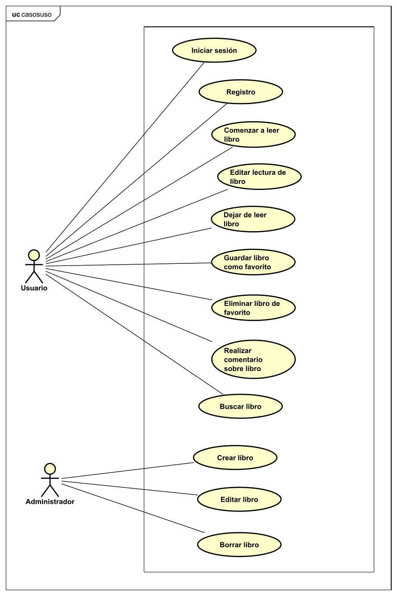
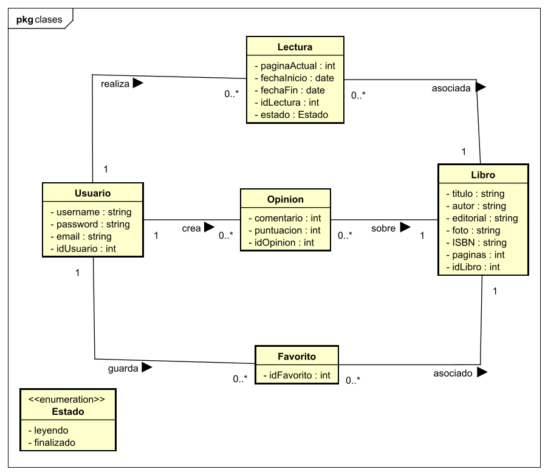
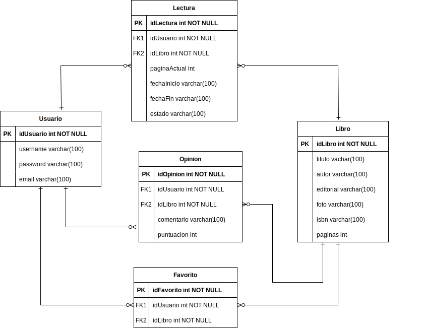
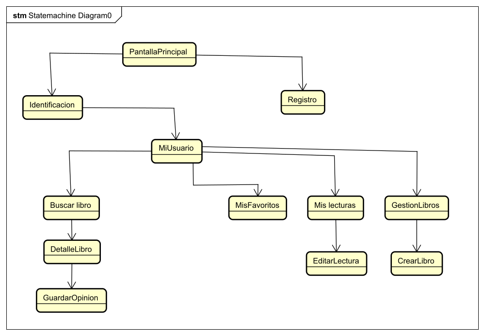
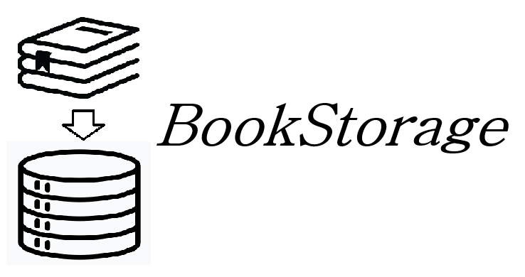

<h1>Documento resumen del proyecto para crear la aplicación "BookStore"</h1>

<ol>
<h2><li>Resumen del proyecto</li></h2>

Esta aplicación permitirá gestionar los libros que lees. El usuario podrá guardar datos sobre los libros que lee, como la fecha de inicio, la fecha en que acaba o la página en la que se llega. Además podrá guardar sus libros favoritos para acceder a ellos rápidamente. Podrá publicar opiniones sobre los libros para que todos los usuarios las lean. Los libros son gestionados por el administrador que puede añadir nuevos, eliminarlos o editarlos.

<h2><li>Aplicaciones similares</li></h2>

Se han encontrado diferentes aplicaciones en la playstore similares a las de este proyecto:

<ol>
  <li>My library</li>
  <li>Bookshelf</li>

</ol>

<h2><li>Tecnologías utilizadas</li></h2>

Se van a utilizar las siguientes tecnologías:

<ul>

<li>Frontend y Backend: Bootstrap y Django</li>
<li>Base de datos: MySQL</li>
</ul>

<h2><li>Funcionalidad de la aplicación. Casos de uso</li></h2>

A continuación se expone el diagrama de casos de uso de la aplicación:

<h2><li>Diagrama de clases</li></h2>

A continuacion se expone el diagrama de clases de la aplicación:

<h2><li>Estructura de la base de datos</li></h2>
A continuación se muestra el diagrama entidad relación en la base de datos:

<h2><li>Estructura del backend</li></h2>

Mediante Django se definen rutas sobre las cuales se pueden mandar peticiones con las operaciones a realizar, ya sean para obtener datos o modificarlos en la base de datos. Esta parte hecha con Python accede a la base de datos y obtiene los datos o los modifica.

<h2><li>Estructura del frontend</li></h2>
La aplicación contará con las siguientes vistas:
<ul>
<li>PantallaPrincipal: esta vista funcionará como una landing page.</li>
<li>Identificación: esta vista contará con un formulario para que un usuario se identifique.</li>
<li>Registro: esta vista contará con un formulario para que un usuario se registre. </li>
<li>MiUsuario: esta será la vista principal que aparecerá al identificarse. Desde aquí se puede acceder a las demás vistas.</li>
<li>MisFavoritos: en esta vista se mostrarán los libros favoritos del usuario.</li>
<li>MisLecturas: en esta vista se mostrarán las lecturas del usuario.</li>
<li>EditarLectura: en esta vista se podrá editar los datos de la lectura de un libro.</li>
<li>BuscarLibro: esta vista permitirá buscar un libro por nombre y ver los libros almacenados en la aplicación.</li>
<li>DetallesLibro: esta vista mostrará los detalles de un libro.</li>
<li>GuardarOpinion: esta vista contendrá un formulario donde el usuario puede introducir la opinión sobre un libro.</li>
<li>GestionLibros: en esta vista el administrador podrá ver todos los libros almacenados en la aplicación.</li>
<li>CrearLibro: en esta vista el administrador podra crear un nuevo libro y editar los campos de uno existente.</li>

</ul>

La navegación entre las diferentes vistas en la siguiente:

<h2><li>Bocetos del frontend</li></h2>
Se han realizado bocetos con Figma con la idea básica de como será la aplicación. Estos bocetos han servido de guía para el desarrollo de la aplicación, sin embargo durante el desarrollo se han encontrado mejoras sobre estos bocetos. Por lo tanto el resultado final, combina los bocetos con ideas aparecidas durante el desarrollo. Los bocetos se encuentran en el pdf adjunto bocetos-bookstorage.

<h2><li>Detalles de la aplicacion</li></h2>
<ul>

<li>Colores:
<ul>
<li>Naranja:#FF963E</li>
<li>Marrón:#A45411</li>
</ul>
</li>
<li>Icono:</li>

</ul>
<h2><li>Registro del tiempo</li></h2>

A continuación se detalla el tiempo utilizado para el proyecto: 

<strong>Tiempo empleado: 1105 minutos (18 horas y 25 minutos)</strong>

<h2><li>Resultado final: vídeo youtube y repositorio</li></h2>
Repositorio Github:

<h2><li>Conclusiones</li></h2>
He aprendido las principales funcionalidades de Django para crear una aplicación web. He aprendido a utilizar Python en el desarrollo web que proporciona grandes ventajas. He conseguido almacenar los datos en una base de datos MySQL y acceder a esos datos mediante Python con Django. 

</ol>